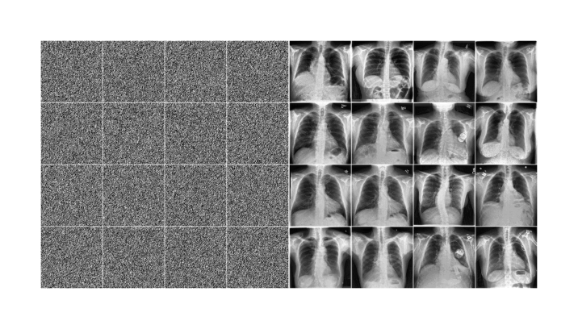

# CXR Diffusion: A Generative Model for Chest X-Ray Synthesis


## Overview

This repository contains the implementation of a Denoising Diffusion Probabilistic Model (DDPM) tailored for the generation of synthetic chest X-ray (CXR) images. The model is conditioned on patient demographics and echocardiogram measurements to produce realistic and clinically relevant CXR images. The generated images can be used to augment training datasets, improve diagnostic model performance, and address data scarcity in medical imaging.

## Features

- **Conditional Image Generation:** Generate CXR images based on specific patient characteristics, including age, sex, and echocardiogram measurements.
- **Customizable Parameters:** Adjust the conditioning parameters to explore various demographic and clinical scenarios.
- **High-Quality Image Synthesis:** Utilizes advanced diffusion techniques to create high-fidelity images that closely resemble real-world CXRs.



## Local Usage

1. Download the data.
    
    The data is available for download through [Physionet.](https://physionet.org/content/chexchonet/1.0.0/)

2. Install the requirements.

   ```bash
    pip install -r requirements.txt
    ```
   
3. Launch the notebook [complete_notebook](complete_notebook.ipynb)

## Remote Usage

This code was developed using Google Colab. The [complete_notebook](complete_notebook.ipynb) can be run on the platform. 

## Training Configurations

The training configuration used within this repository can be found [here](src/train/training_configs/class_diffusion_large_224.yaml). Different configurations can be explored by updating parameters. Some parameters of interest include:

- Training Model Type: **model_name**. Options include basic_diffusion, input_diffusion, input_diffusion_large, class_diffusion, class_diffusion_large. 
- Image Output Size: **downsample_size**. Change this to desired image resolution.
- Loss Function: **loss_fn**. Options include mse_p, mse.
- Optimizer: **optimizer**. Options include adam, adamw, sgd
- Learning Rate: **lr**
- Batch Size: **batch_size**
- Number of Training Epochs: **num_epochs**

